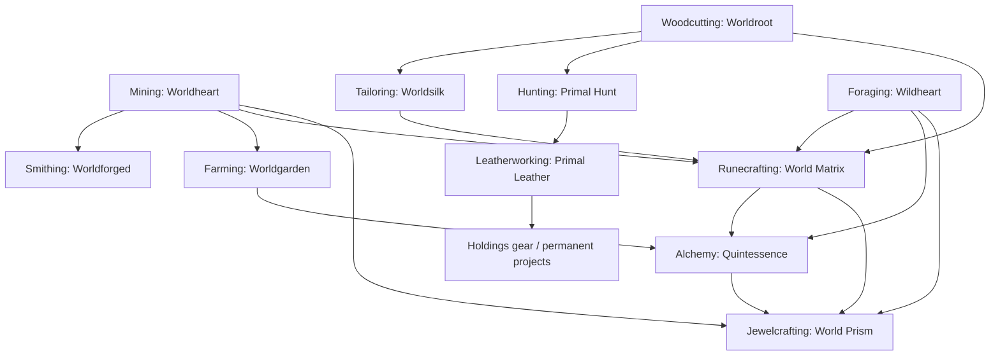

# Endgame Resource Dependency DAG

**Status:** Canonical dependency order v1.0

Post-100 content remains selective: Mastery, specialized projects, and a small number of convergence materials. This graph does not introduce full T11 profession ladders.

## Dependency contract

1. Frontier gathering establishes Worldheart, Worldroot, Wildheart, Primal Hunt, and Worldgarden resources from already mastered T10 systems.
2. Frontier processing converts these into Worldforged, Worldsilk, and Primal Leather. Primal Leather is a terminal equipment/project material in this DAG; it is not an input to Quintessence or World Matrix.
3. World Matrix uses Worldheart, Worldroot, Wildheart, Worldsilk, and T10 magical materials. It does not require Quintessence.
4. Quintessence uses Wildheart, Worldgarden/Genesis Fruit, T10 Astral Essence, and Alchemy extracts. It does not feed World Matrix.
5. World Prism is downstream of World Matrix and Quintessence, with its other registered endgame inputs.

The graph is acyclic. World Prism is crafted, not mined. No endgame material is a mandatory input to the earlier profession unlock required to produce that same material. World Matrix and Quintessence can converge at World Prism without feeding one another in both directions.
